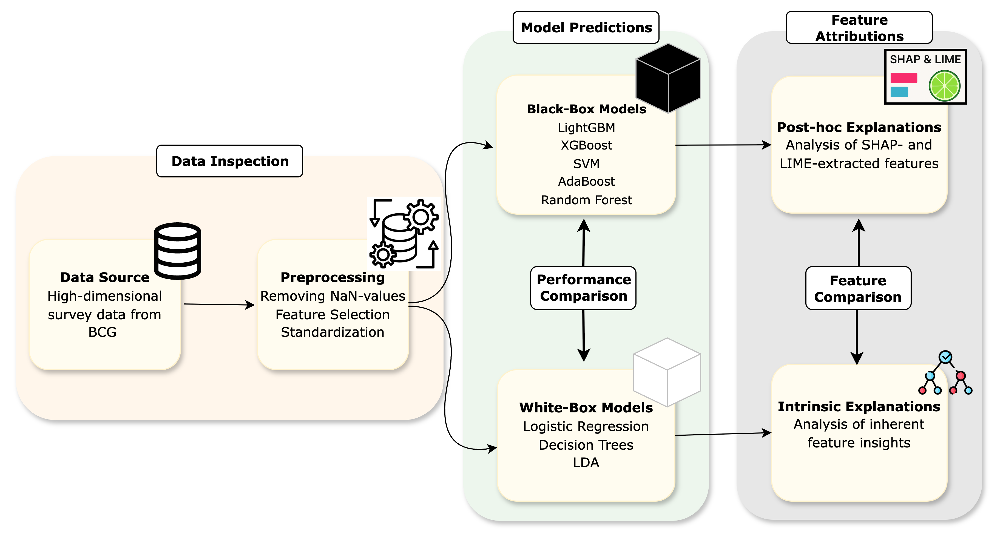

# Switching_Behavior_in_Health_Insurance
## Project Description

This project analyzes switching behavior in the health insurance sector.  
The goal is to compare different machine learning models for churn prediction and investigate how explainable AI (XAI) methods can reveal key factors behind customers' switching intentions.

### Research Questions

- **RQ1:** Which customer characteristics are most predictive of switching behavior?  
- **RQ2:** What explainable factors drive individuals to change insurers?  
- **RQ3:** Can we build interpretable switching personas to support insurer strategy?

---

## Motivation

Retaining existing customers is significantly more cost-effective than acquiring new ones.  
As competition in health insurance markets (e.g., Germany, Switzerland, USA) increases, understanding why customers switch becomes critical for sustainable customer relationship management (CRM).  
Machine learning (ML) models can support churn prediction, but often lack interpretability—this is where explainable AI (XAI) methods come in.

---

## Methodology

- Comparison of **black-box models**:  
  - LightGBM  
  - Random Forest
  - AdaBoost 
  - XGBoost  
  - SVM  
- Comparison with **white-box models**:  
  - Logistic Regression  
  - Decision Tree
  - ID3 Decision Tree
  - LDA
- Evaluation using **F1 score**, **Recall** and **Precision**  
- Explanation of model outputs using **SHAP** and **LIME**  
- Identification of key churn predictors and **switching personas**
- Workflow is shown in following figure:

---

Each model is implemented in a **separate notebook**, which also includes the corresponding XAI methods:

- `Black_Box_Models.ipynb` → contains LightGBM, Random Forest, XGBoost, SVM + SHAP/LIME  
- `White_Box_Models.ipynb` → contains Logistic Regression, Decision Tree + model-specific feature explanations

---
