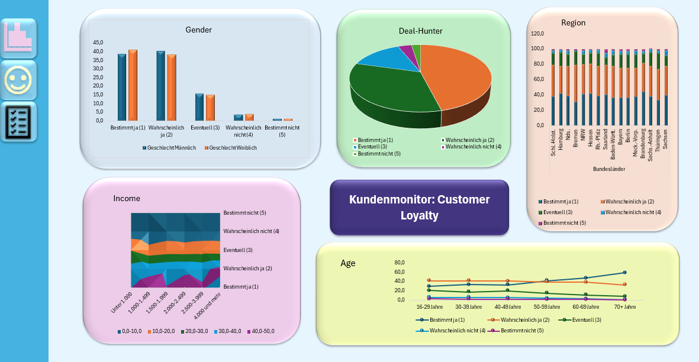
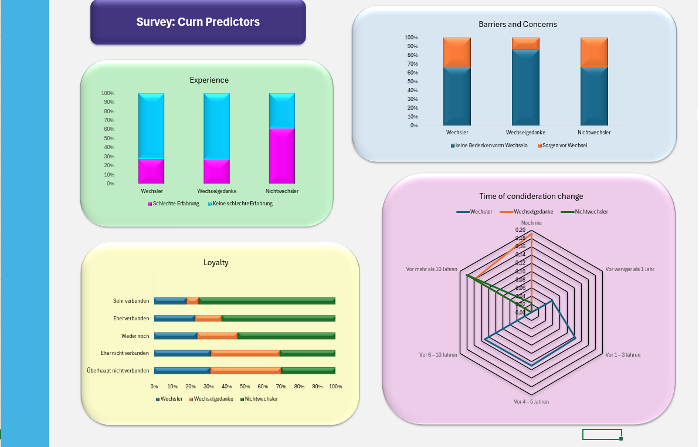

# 📊 Health Insurance Switching Behavior – Prediction Dashboard
This project provides an interactive **Streamlit dashboard** to analyze and visualize predictions from machine learning models about **switching behavior in health insurance**.

## Step 1:
In order to display the dashboard, please make sure you have installed the requirements 

    pip install requirements.txt

## Step 2:
Make sure you have downloaded the whole folder with the model checkpoints before using the dashboard.
Once you have downloaded the folder you can access the dashboard simply by running the following in the terminal:

    streamlit run dashboard.py

## Step 3:
The dashboard will open and you can now insert the file **preprocessed_servery_data.csv**.
In the dashboard, you can choose between several models to see their predictions.

